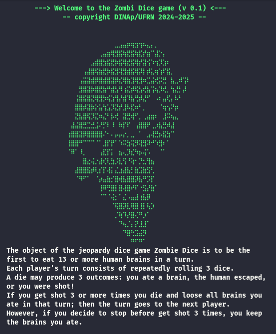

<h1 align="center">🧟 zdice  — zombie dice </h1>

<p align="center">
    <b>zdice</b> game you and the other players are zombies trying to collect brains and avoid the very nasty humans who are trying to surprise you with their shotguns
</p>

<p align="center">
    
</p>

## 👨‍💻 Authors

This project was developed by José Carlos da Paz Silva [carlos.paz.707@ufrn.edu.br](mailto:carlos.paz.707@ufrn.edu.br) and [leandro.andrade.401@ufrn.edu.br](mailto:leandro.andrade.401@ufrn.edu.br) as part of the *Programação I* course at UFRN.

## 🚀 Compiling and Runnig

### 🛠️ Using cmake

*Note:* This method requires CMake to be installed on your system. CMake is a cross-platform build system generator used to configure and compile the project. If it's not already installed, you can install it using your system’s package manager (e.g., sudo apt install cmake on Debian/Ubuntu or brew install cmake on macOS).

1. Clone this repository:

```bash
git clone https://github.com/selan-active-classes/trabalho-06-projeto-zombie-dice-multiplayer
```

2. Navigate to the project directory:

```bash
cd trabalho-06-projeto-zombie-dice-multiplayer
```

3. Compile and build the program using `cmake`:

```bash
cmake -S . -B build
cmake --build build
```

4. Run:

```bash
./bin/zdice <file.ini>
```

---

> [!tip]
> Run **./bin/zdice [-h | --help ]** to view all available options and usage instructions.

---

## ✅ Grading

| Item                                     | Max value | Expected value |
| ---------------------------------------- | :-------: | :------------: |
| The project contains at least 2 classes  |     7     |        7       |
| Show help as requested `-h`              |     4     |        4       |
| Read player names                        |     10    |       10       |
| Show all 5 regions in user interface     |     12    |       12       |
| Keeps overall scores                     |     5     |        5       |
| Keeps bag of dice consistent             |     5     |        5       |
| Handles automatic turn hand over         |     5     |        5       |
| Handles hold requests                    |     5     |        5       |
| Handles roll requests                    |     5     |        5       |
| Handles ties                             |    12     |       12       |
| Move brains dice back to bag when needed |    10     |       10       |
| Manages turns correctly                  |     5     |        5       |
| Reads configuration file                 |    15     |       15       |
| Handles user errors                      |     5     |        5       |
| Show winner correctly                    |     5     |        5       |
| Program working fine                     |    10     |       10       |

## ⚠️ Problems found or limitations

The current version of the project does not perform formal verification of the "zdice.ini" configuration file. This means that the player can declare a configuration that should be treated as invalid, `weak_die_face = true`, for example, and there is no explicit verification for this type of situation.

That is, the security of the analysis of the configuration file is currently protected only by the basic types of the language in which it was implemented, which is C++.

---

&copy; DIMAp | Departamento de Informática e Matemática Aplicada (2016 - 2025)
